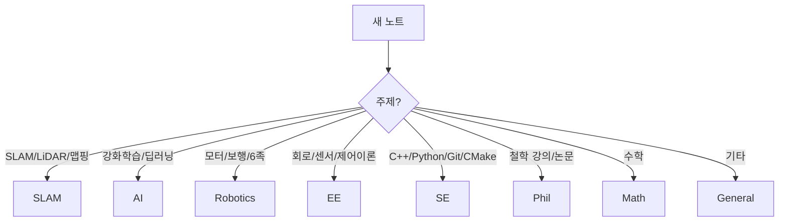

# 📌 Obsidian Vault 가이드라인

> 전기전자공학(SLAM, AI, C++, Python) + 철학 복수전공 + 로봇 동아리 프로젝트를 위한 조직 체계

---

## 0. Quick Start (5분)

### 필수 플러그인
- **Templater** (필수)
- Tag Wrangler, Dataview, Outliner, Omnisearch (권장)

### 템플릿 설정
1. `Settings → Templater → Template folder`: `CMDS/500. setting/501. Template`
2. 새 노트: `Master Template` 실행
3. 단축키 권장: "Create new note from template"

---

## 1. 폴더 구조

```
CMDS/
├── 100. Inbox/          # 빠른 캡처 (임시)
│   ├── 101. 🚨Anything     → 분류 모를 때 기본
│   ├── 102. 📝Daily_Note   → 일일 노트
│   ├── 103. 🖌️Excalidraw   → 그림/다이어그램
│   ├── 110. Software       → SW 잡메모 (Git, Linux)
│   ├── 120. Engineering    → 공학 잡메모
│   ├── 130. Philosophy     → 철학 잡메모
│   └── 140. Web_Clipper    → 웹클립 임시저장
│
├── 200. CMDS/           # 지식 흐름 core
│   ├── 201. Connect       → 강의 필기 (받아쓰기)
│   ├── 220. Merge         → 내 지식 (Feynman)
│   ├── 240. Develop       → 치트시트/이론 정리
│   ├── 260. Share         → 외부 공유 산출물
│   └── 280. Project       → 로봇/대회 프로젝트
│
├── 400. Reference/      # 보관 자료
│   ├── 401. Anything_Reference
│   ├── 410. Software_Reference
│   ├── 420. Engineering_Reference
│   ├── 430. Philosophy_Reference
│   └── 490. People_Reference/
│       ├── 491. Acquaintance  → 지인
│       ├── 492. Engineering   → 공학 인물
│       ├── 493. Philosophy    → 철학 인물
│       └── 494. Unknown       → 불명
│
└── 500. setting/        # 설정/템플릿
```

### 핵심 규칙
| 상황 | 저장 위치 |
|------|----------|
| 분류 모름 / 3초 안에 판단 불가 | `101. 🚨Anything` |
| 강의 필기 | `201. Connect` |
| 내 말로 정리한 지식 | `220. Merge` |
| 논문/책/자료 보관 | `400. Reference/*` |
| 로봇/대회 프로젝트 | `280. Project` |

---

## 2. Properties 규칙

### 필수 속성 (7개)
| 속성 | 설명 | 값 |
|------|------|-----|
| `type` | 노트 역할 | `inbox`, `daily`, `lecture`, `reference`, `merge`, `develop`, `share`, `project`, `people` |
| `created` | 생성일 | `2026-01-11` |
| `updated` | 수정일시 | `2026-01-11T21:00:00` |
| `author` | 작성자 | `[[김선음]]` (내 글) / 비움 (참조) |
| `group` | 분야 | 아래 참조 |
| `status` | 상태 | `[[🌱Seed]]`, `[[🌿Sapling]]`, `[[🌲Evergreen]]`, `[[🍂Archive]]`, `[[🚜In Progress]]` |
| `tags` | 작업 큐 | 배열 |

### 유형별 선택 속성
| 속성 | 사용처 |
|------|--------|
| `source_url` | webclip, reference, lecture |
| `course`, `session`, `instructor` | lecture |
| `goal`, `deadline`, `repo` | project |
| `people_kind`, `organization` | people |

---

## 3. Group 분류 (핵심)

| Group | 설명 | 예시 |
|-------|------|------|
| **SLAM** | SLAM, 위치인식, 맵핑 | LIDAR SLAM, Visual SLAM, Localization |
| **AI** | 인공지능, 강화학습, 딥러닝 | RL, DL, 신경망, 강화학습 |
| **Robotics** | 로봇공학, 모터제어, 보행 | 모터제어, 6족로봇, 보행계획 |
| **EE** | 전기전자 일반, 회로, 제어 | 제어이론, 회로, 센서, 신호처리 |
| **SE** | 소프트웨어, C++, Python | 언어, 빌드시스템(CMake), Git |
| **Phil** | 철학 | 인식론, 윤리학, 형이상학 |
| **Math** | 수학 | 선형대수, 미적분, 확률 |
| **General** | 기타 | - |

### 선택 가이드



---

## 4. 태그 규칙

태그는 **작업 큐**로 사용 (주제 분류 X)

### 필수 태그
| 태그 | 의미 |
|------|------|
| `tagging/needed` | 나중에 정리 필요 |

### 권장 태그
| 태그 | 의미 |
|------|------|
| `to-merge` | Merge 노트로 만들어야 함 |
| `to-review` | 다시 읽을 자료 |
| `flashcards` | 암기 카드로 뽑을 것 |

> **주제(로봇/SLAM/제어 등)는 태그 대신 `[[링크]]`로 연결**

---

## 5. 파일명 Prefix

| Prefix | 유형 | 예시 |
|--------|------|------|
| `N -` | Inbox 메모 | `N - 아이디어` |
| `D -` | Daily | `D - 2026-01-11` |
| `L -` | Lecture | `L - 로봇공학 3주차` |
| `W -` | Web clip (임시) | `W - CMake 가이드` |
| `R -` | Reference | `R - SLAM 논문` |
| `PRJ -` | Project | `PRJ - 6족로봇` |
| `M -` | Merge | `M - 칼만필터 이해` |
| `DEV -` | Develop | `DEV - ROS2 치트시트` |
| `SHARE -` | Share | `SHARE - 블로그 초안` |
| `PPL -` | People | `PPL - 홍길동` |

---

## 6. 워크플로우

### 일일 (캡처 중심)
```
강의 → L - 노트 (Connect)
웹 저장 → W - 노트 (Web_Clipper) 또는 R - 노트 (Reference)
아이디어 → N - 노트 (Inbox)
```
**핵심: 정리하려고 멈추지 않는다**

### 주 2회 (20~30분 정리)
1. `tagging/needed` 검색
2. 3개만 처리:
   - 버릴 것 → 삭제
   - 자료 → Reference 이동
   - 이해 필요 → Merge 생성 + 원본 링크
3. 처리 후 `tagging/needed` 제거

### 프로젝트 진행 시
- `PRJ -` 노트가 컨트롤타워
- 매일: Log 1줄, Decision 1개
- 모르는 개념 → Merge로 만들고 프로젝트에서 링크

---

## 7. 프로젝트 운영 (로봇/대회)

### PRJ 노트 필수 섹션
1. **Goal** - 목표 1줄
2. **Requirements** - 요구사항
3. **Constraints** - 제약조건
4. **Plan** - 마일스톤
5. **Log** - 날짜별 진행 기록
6. **References/Merge links** - 근거 링크

### 예시: 6족 로봇 프로젝트
```markdown
# PRJ - 6족 로봇

## Goal
- 6족 로봇 자율 보행 구현

## Log
- 2026-01-11 - 보행 알고리즘 조사 시작
- 2026-01-12 - [[M - Tripod Gait]] 정리

## Related
- [[M - 강화학습 기초]]
- [[R - 보행 상태 추정]]
```

---

## 8. FAQ

### Q1. 어디에 저장해야 할지 모르겠어요
→ **`101. 🚨Anything`** + `tagging/needed` 태그

### Q2. 웹클립이 애매해요
→ 기본은 **임시(Web_Clipper)**, 살아남은 것만 Reference 승격

### Q3. 강의 필기에 내 생각이 섞였어요
→ 강의 노트(L -)는 그대로, **Merge(M -)를 새로 만들어** 내 이해 정리

### Q4. SLAM인데 코드도 있어요
→ **주된 내용 기준** (SLAM 개념 > SE), 필요시 태그로 보조

### Q5. Group을 여러 개 쓰고 싶어요
→ **1개만 선택** (가장 핵심 주제), 나머지는 `[[링크]]`로 연결

---

## 9. 폴더 정리 체크리스트

> 현재 중복/오타 폴더가 있습니다. 아래 작업을 수행하세요.

### 삭제/병합 대상
| 삭제할 폴더 | 유지할 폴더 | 작업 |
|------------|------------|------|
| `101. 📥️Anything` | `101. 🚨Anything` | 내용 이동 후 삭제 |
| `102. ✅ Daily_Note` | `102. 📝Daily_Note` | 내용 이동 후 삭제 |
| `400. Anything_Reference` | `401. Anything_Reference` | 내용 이동 후 삭제 |
| `410. SoftWare_Reference` | `410. Software_Reference` | 내용 이동 후 삭제 |
| `420. Enginnering_Reference` | `420. Engineering_Reference` | 내용 이동 후 삭제 |

### 작업 방법
1. 삭제할 폴더의 파일들을 유지할 폴더로 이동
2. 빈 폴더 삭제
3. Master Template 실행 테스트

---

*Last updated: 2026-01-11*
